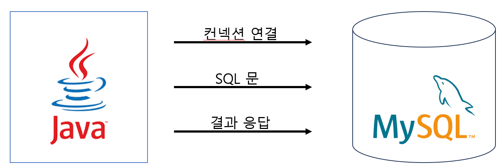
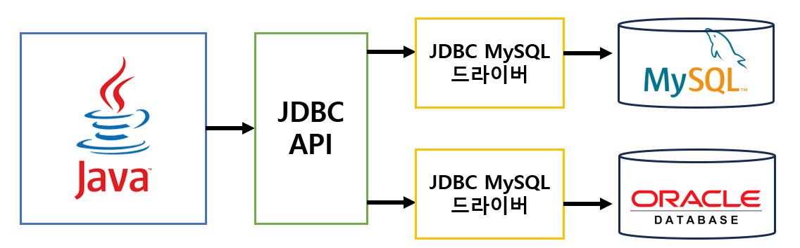

## 등장배경

애플리케이션 서버에서 DB를 연결하기 위해 아래와 같이 구성하였다.

> Q. 만약 MySQL에서 Oracle 로 교체를 하면 정상 동작할까?
>
> A. 데이터베이스마다 연결 방식, SQL 전달 방식, 결과를 응답으로 받는 방식 모두 다르기 때문에 불가능 하다.

데이터베이스 변경시 코드를 모두 수정해야하는 과정을 거쳐야 한다. 이러한 문제를 해결할 수 있는게 바로 JDBC라는 Java 표준 API이다.

## JDBC (Java DataBase Connectivity)

JDBC란 자바를 이용하여 DB에 접근하여 SQL문을 수행할 수 있도록 제공하는 API다.
- 자바에서 모든 DBMS에서 공통적으로 사용할 수 있도록 JDBC를 인터페이스로 구현하였고, 실제 구현 클래스는 각 DBMS의 벤더에게 구현하도록 하였다.
- DBMS의 벤더에서 제공되는 구현클래스를 **JDBC 드라이버**라고 한다.

JDBC를 통해 DBMS에 맞는 드라이버만 설정해주면 기존코드 수정없이 사용가능하다.

## 드라이버 종류

https://m.blog.naver.com/pjm5111/220719619162

### JDBC-ODBC 브리지 드라이버

- JDBC API로 작성된 프로그램이 JDBC-ODBC 브리지를 통해 ODBC 드라이버를 JDBC 드라이버로 여기고 동작하도록 한다.
- 단, JDBC API로 작성된 프로그램이 동작하는 OS내에 반드시 ODBC 드라이버가 존재해야함.

### 데이터 베이스 API(A Native-API partly-Java) 드라이버

- JDBC API 호출을 특정 데이터베이스의 클라이언트 호출 API로 바꿔 주는 드라이버이다.

