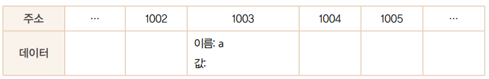
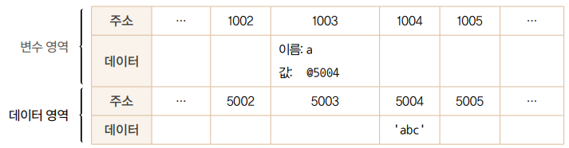
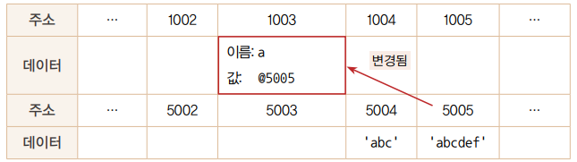
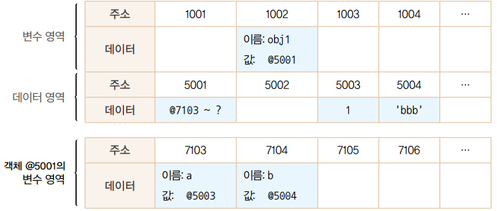
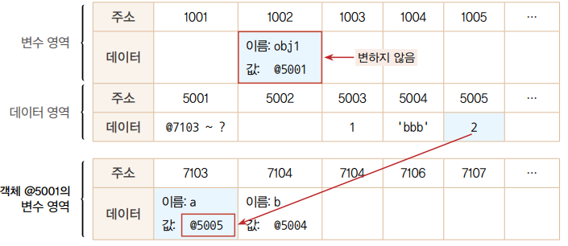
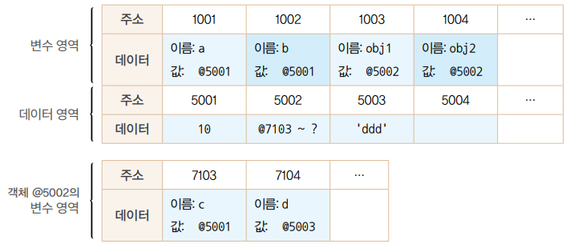
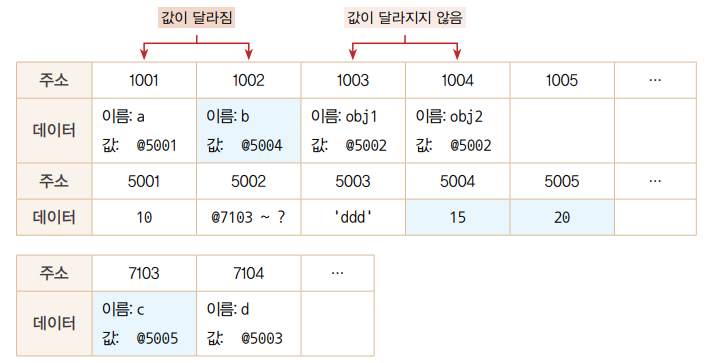
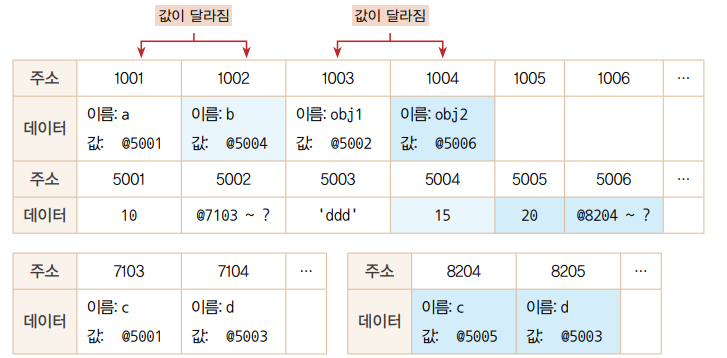

## 데이터 타입의 종류

- 기본형 (Primitive Type)
  - Number , String , boolean , null , undefined
  - 기본형은 값이 담긴 주솟값을 복제 , **불변성**이다.
- 참조형 (Reference Type)
  - Object , Array , Function , Date , RegExp
  - 참조형은 값이 담긴 주솟값들로 이루어진 묶음을 가르키는 주솟값을 복제

---

## 변수 (Variable)

변수는 '변할 수 있는 수'이다.

```javascript
var a;
```

위 와같이 선언할 경우 '변할 수 있는 데이터를 만들고, 식별자로 a로 한다.' 라고 해석할 수 있다.

### 메모리



위와 같이 변수 선언시 변수 영역의 빈 공간(1003)에 식별자 'a' 로 지정한다.

---

## 데이터 할당

```javascript
var a; // 변수 a 선언
a = 'abc'; // 변수 a에 데이터 할당
```

위와 같이 변수를 선언이후 값을 할당하였다.

### 메모리



위와 같은 경우 변수 영역의 빈 공간(1003)에 식별자 'a' 로 지정이후 데이터 영역의 빈 공간(5004)에 문자열('abc')을 저장한다.

> Q. 왜 값을 데이터 영역에 따로 저장을 할까?
>
> A. 문자열 데이터의 경우 특별히 정해진 규격이 없고 메모리 용량이 가변적이며 전체 글자 수 역시 가변적이다.
> 그렇기 때문에 미리 확보할 경우 데이터 크기에 맞게 늘리는 작업이 선행 되어야 한다.
> 맨 마지막 데이터일 경우 늘리면 그만이지만 가운데 존재하는 데이터의 경우 뒤의 데이터를 전부 이동시켜는 작업을 해서 연산이 많아진다.

---

## 불변성

변수와 상수를 구분하는 성질은 '변경 가능성'이다. 바꿀 수 있으면 변수, 바꿀 수 없으면 상수이다. 불변값과 상수는 같은 개념으로 오해하기 쉬운데, 이둘은 명확히 구분할 필요가
있다.

```javascript
var a = 'abc';
a = a + 'def';
```

a 에다 'abc' + 'def' 를 할 경우



예상과 다르게 새로운 문자열 'abcdef'를 만들어 그 주소를 변수 a에 주소를 할당한다.

```javascript
var b = 5;
var c = 5;
b = 7;
```

b,c 에 5를 할당할 경우 5가 2개 생기는 것이 아닌 b가 생성한 데이터 영역(5가 저장된 주소)를 같이 가르키고 있게 된다. b = 7로 b값을 변경시 5가 7이 되는 것이
아닌 새로운 데이터 영역(7이 저장된 주소)를 생성하고 가르키고 있게 된다.

---

## 가변값

> Q. 기본형 데이터는 모두 불변값이라고 했는데 참조형 데이터는 모두 가변값일까?
>
> A. 기본적인 성질은 가변값인 경우가 많지만 설정에 따라 변경 불가능한 경우가 있고, 불변값으로 활용하는 방안도 존재한다.

### 참조형 데이터를 변수에 할당하는 과정

```javascript
var obj1 = {
  a: 1,
  b: 'bbb'
};
```



위를 보면 obj1을 변수 영역의 빈 공간(1002) 에 할당하고 데이터 영역에 저장할려고 보니 여러 개의 프로퍼티로 이루어져 있어 각각의 변수 영역의 주소(7103~7014)를
가르키고 있고 각각 데이터 영역의 빈 공간(5003,5004)에 값을 저장하게 된다.

### 값 변경

```javascript
obj1.a = 2;
```

a 에 2를 대입하였다고 가정하자.




그림과 같이 데이터 영역에 저장된 값은 모두 불변값이지만 변수에는 다른 값을 얼마든지 대입할 수 있기 때문에 **참조형 데이터는 가변값이다** 라고 하는 것이다.

---

## 변수 복사 비교

```javascript
var a = 10;
var b = a;

var obj1 = {c: 10, d: 'ddd'};
var obj2 = obj1;
```



위와 같이 할당된다. 만약 데이터를 변경시 기본형 데이터와 참조형 데이터의 차이점이 무엇일까

### 값 변경 1

```javascript
b = 15;
obj2.c = 20;
```



기본형의 경우 새로운 데이터 영역을 가르켜 값이 달라지지만 참조형 데이터의 경우 같은 데이터 영역을 바라보기 때문에 값이 달라지지 않는다.

즉, obj2 를 수정하였지만 obj1 도 적용된다.

### 값 변경 2

```javascript
obj2 = {c: 20, d: 'ddd'};
```



---

## 불변 객체 만드는 방식

```javascript
var user = {
  name: 'Jaenam',
  gender: 'male'
};

var changeName = function (user, newName) {
  var newUser = user;
  newUser.name = newName;
  return newName;
};

var user2 = changeName(user, 'Jung');
```

> Q. user2를 changeName 함수를 통해 이름 변경시 ```user1 !== user2``` 를 만족할까?
>
> A. 만족하지 않는다. 이역시 바라보는 곳이 같기 때문에 user2를 수정해도 user1도 적용되어 ```user1 === user2```라는 결과가 나온다.

---

```javascript
var changeName = function (user, newName) {
  return {
    name: newName,
    gender: user.gender
  };
};
```

> Q. 위처럼 수정하면 ```user1 !== user2```를 만족할까?
>
> A. 만족한다. 하지만 gender를 하드코딩해야하고 만약 정보가 많다면 변경해야 할 정보가 많게 되어 좋은 방식은 아니다.

---

```javascript
var copyObject = function (target) {
  var result = {};
  for (var prop in target) {
    result[prop] = target[prop];
  }
  return result;
}
```

for in 문법을 통해 result 객체에 target 객체의 프로퍼티들을 복사하는 방법을 활용하여 객체를 복사할 수 있다.

copyObject를 통해 user 객체를 변경하게 규칙을 정한다면 user 객체가 불변 객체라고 볼 수 있다. 하지만 '얕은 복사만 수행한다'라는 단점이 있다.

### 얕은 복사와 깊은 복사

얕은 복사는 바로 아래 단계의 값만 복사하는 방법이고, 깊은 복사는 내부의 모든 값을 전부 복사하는 방법이다.

### 얕은 복사

```javascript
var user = {
  name: 'jaenam',
  urls: {
    portfolio: 'http://github/abc',
    blog: 'http://blog.com',
    facebook: 'http://facebook.com/abc'
  }
};
var user2 = copyObject(user);

user2.name = copyObject(user);

console.log(user.name === user2.name); //false

user.urls.portfolio = 'http://portfolio.com';
console.log(user.urls.portfolio === user2.urls.portfolio); //true

user.urls.blog = '';
console.log(user.urls.blog === user2.urls.blog); //true
```

user 객체를 복사하게 되면 name의 경우 변경시 서로 다른 값이 나오지만 urls 의 protfolio, blog는 같이 변경되게 된다.

### 깊은 복사

그렇기 때문에 user의 urls 도 복사를 해주어야 한다.

```javascript
var user2 = copyObject(user);
user2.urls = copyObject(user.urls);
```

이렇게 할 경우 urls도 변경시 user 와 서로 다른 값이 나온다.

```javascript
var copyObjectDeep = function (target) {
  var result = {};
  if (typeof target === 'object' && target !== null) {
    for (var prop in target) {
      result[prop] = copyObject(target[prop]);
    }
  } else {
    result = target;
  }
  return result;
}
```

copyObject 메서드를 재귀 호출을 통해 깊게 복사 되도록 설계하면 된다.

```javascript
var copyObjectViaJSON = function (target) {
  return JSON.parse(JSON.stringify(target));
}
```

객체를 JSON 문법으로 변경하였다가 가시 객체로 바꾸는 방법으로 깊은 복사를 할 수 있다.


