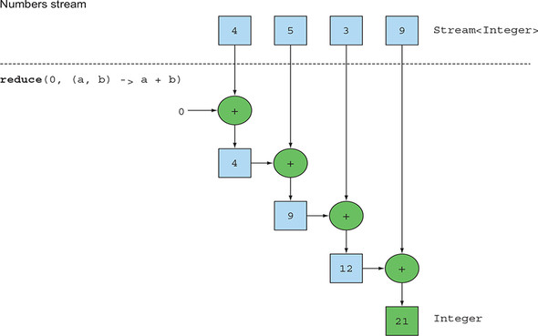

## 스트림 활용

데이터를 어떻게 처리할지는 스트림 API가 관리하므로 편리하게 데이터 관련 작업을 할 수 있다. 따라서 스트림 API 내부적으로 다양한 최적화가 이루어질 수 있다.
스트림 API는 내부 반복 뿐 아니라 코드를 병렬로 실행할지 여부도 결정할 수 있다.

여러 스트림 사용법을 다루어 보겠다.

---

## 필터링 - filter()

스트림의 요소를 선택하는 방법은 Predicate를 이용한 필터링, 고유 요소 필터링 두가지 존재한다.


### 프레디케이트(Predicate) 필터링

```java
/* 채식 요리만 필터링 */
List<Dish> list = menu.stream()
                      .filter(Dish::isVegetarian) // 채식 요리인지 확인하는 메서드 참조
                      .collect(toList());
```


### 고유 요소 필터링

스트림은 고유 요소로 이루어진 스트림을 반환하는 ```distinct``` 메서드를 지원한다.

```java
/* distinct 예제
List<Integer> numbers = Arrays.asList(1, 2, 3, 3, 2, 4);
  numbers.stream()
  .filter(i -> i % 2 == 0)
  .distinct() //중복을 필터링
  .forEach(System.out::println);
```


---

## 스트림 슬라이싱 - takeWhile(), dropWhile()

스트림의 요소를 선택하거나 스킵하는 다양한 방법이 있다.

### 프레디케이트(Predicate)를 이용한 슬라이싱

스트림의 요소를 효과적으로 선택할 수 있도록 ```takeWhile```, ```dropWhile``` 두가지 메서드를 지원한다.

#### TAKEWHILE 활용

```java
/* 정렬되어 있는 데이터*/
List<Dish> specialMenu = Arrays.asList(
    new Dish("seasonal fruit", true, 120, Dish.Type.OTHER),
    new Dish("prawns", false, 300, Dish.Type.FISH),
    new Dish("rice", true, 350, Dish.Type.OTHER),
    new Dish("chicken", false, 400, Dish.Type.MEAT),
    new Dish("french fries", true, 530, Dish.Type.OTHER)
);

List<Dish> filteredMenu
    = specialMenu.stream()
                 .filter(dish -> dish.getCalories() < 320)
                 .collect(toList());
```

filter 연산을 이용하면 전체 스트림을 반복하면서 각 요소에 프레디케이트를 적용하게 된다.

> Q. 위처럼 **정렬되어 있는 데이터**를 전체 스트림을 반복해서 처리하는게 효율적일까?
>
> A. 아니다. 위의 경우 데이터가 적어서 상관없지만 클 경우 상당한 차이가 있다. 이때 takeWhile 를 이용하면 된다.

```java
List<Dish> slicedMenu1
    = specialMenu.stream()
                 .takeWhile(dish -> dish.getCalories() < 320)
                 .collect(toList());
```

```takeWhile```을 활용할 경우 **조건을 불만족** (칼로리가 320 보다 같거나 클 경우) 반복을 중단하고 반환한다.

#### DROPWHILE 활용

```java
List<Dish> slicedMenu2
    = specialMenu.stream()
                 .dropWhile(dish -> dish.getCalories() < 320)
                 .collect(toList());
```

```dropWhile``` 의 경우에는 ```takeWhile``` 과 반대로 조건이 불만족하게 되면 그 지점에서 작업을 중단하고 남은 요소를 반환한다.

---

## 스트림 축소 - limit(N)

스트림은 주어진 값 이하의 크기를 갖는 새로운 스트림을 반환하는 ```limit(N)``` 메서드를 지원한다.

```java
List<Dish> dishes = specialMenu
                        .stream()
                        .filter(dish -> dish.getCalories() > 300)
                        .limit(3)
                        .collect(toList());
```

```limit(N)```는 프레디케이트와 일치하는 처음 N요소를 선택한 다음 즉시 결과를 반환한다.
- 만약 정렬되어 있지 않는 데이터라면 정렬되지 않은 상태로 반환한다.


## 요소 건너뛰기 - skip(N)

스트림은 처음 N개 요소를 제외한 스트림을 반환하는 ```skip(N)```를 지원한다.

```java
List<Dish> dishes = specialMenu
                        .stream()
                        .filter(dish -> dish.getCalories() > 300)
                        .limit(3)
                        .collect(toList());
```
```skip(N)``` 메서드는 ```limit(N)``` 메서드와 상호 보완적인 연산을 수행한다.


## 맵핑

스트림은 특정 데이터를 선택하는 ```map```, ```flatMap``` 메서드를 지원한다.

### 스트림의 각 요소에 함수 적용하기 - map(), flatMap()

요리의 요리명만 추출하고 싶다면?

```java
List<String> dishNames = menu.stream()
                             .map(Dish::getName) //Stream<String>
                             .collect(toList());
```

만약 요리 이름의 길이 리스트를 반환하게 하고 싶다면?

```java
List<Integer> dishNameLengths = menu.stream()
                                   .map(Dish::getName)
                                   .map(String::length)
                                   .collect(toList());
```

### 스트림 평면화

```["Hello", "World"]``` 리스트가 있다면 ```["H," "e," "l," "o," "W," "r," "d"]``` 의 리스트를 반환해보자.

```java
words.stream()
     .map(word -> word.split("")) // Stream<String[]>
     .distinct()
     .collect(toList());
```

이렇게 생각할 수 있는데 문제점이 있다.

```map```의 반환 값이 ```Stream<String[]>```으로 원했던 ```Stream<String>```이 아니다.


### map과 Arrays.stream 활용

```java
words.stream()
     .map(word -> word.split("")) // Stream<String[]>
     .map(Arrays::stream) // Stream<Stream<String>>
     .distinct()
     .collect(toList());
```

이렇게 할경우 스트림 리스트```List<Stream<String>>``` 가 만들어 지면서 문제가 해결되지 않는다.

이를 해결하기 위해서는 먼저 각 단어를 개별 문자열로 이루어진 배열로 만든 다음에 배열을 별도의 스트림으로 만들어야 한다.


### flatMap 사용

```flatMap```은 각 배열을 스트림이 하나의 평면화된 스트림을 반환한다.

```java
List<String> uniqueCharacters =
  words.stream()
       .map(word -> word.split(""))  // Stream<String[]>
       .flatMap(Arrays::stream)      // Stream<String>
       .distinct()
       .collect(toList());
```


## 검색과 매핑

스트림은 특정 속성이 데이터 집합에 있는지 여부를 검색하는 데이터 처리인 ```allMatch```, ```anyMatch```, ```noneMatch```, ```findFirst```, ```findAny``` 를 지원한다.

### 프레디케이트(Predicate)가 적어도 한 요소와 일치하는 확인 - anyMatch()

```java
if (menu.stream().anyMatch(Dish::isVegetarian)) {
    System.out.println("The menu is (somewhat) vegetarian friendly!!");
}
```

### 프레디케이트(Predicate)가 모든 요소와 일치하는지 확인 - allMatch()

```java
boolean isHealthy = menu.stream()
                        .allMatch(dish -> dish.getCalories() < 1000);
```

### 프레디케이트(Predicate)가 모든 요소가 일치하지 않는지 확인 - noneMatch()
```java
boolean isHealthy = menu.stream()
                        .noneMatch(d -> d.getCalories() >= 1000);
```

### 현재 스트림에서 일치하는 임의의 요소 하나 반환 - findAny()

```java
Optional<Dish> dish =
  menu.stream()
      .filter(Dish::isVegetarian)
      .findAny();
```

### 현재 스트림에서 일치하는 첫 번째 요소 하나 반환 - findFirst()

```java
List<Integer> someNumbers = Arrays.asList(1, 2, 3, 4, 5);
Optional<Integer> firstSquareDivisibleByThree =
  someNumbers.stream()
             .map(n -> n * n)
             .filter(n -> n % 3 == 0)
             .findFirst(); // 9
```

> Q. findFirst와 findAny 메서드 둘다 필요할까?
>
> A. 병렬성 때문에 필요하다. 병렬 실행에서는 첫 번쨰 요소를 찾기 어렵다. 반환 순서가 상관없다면 findAny를 사용하는 것이 좋다.

## 리듀싱

스트림은 리듀싱 연상(모든 스트림 요소를 처리해서 값으로 도출하는)을 지원한다.

함수형 프로그래밍 언어 용어로는 마치 종이를 작은 조각이 될 때까지 반복해서 접는 것과 비슷하다는 의미로 폴드 라고 부른다.

### 요소의 합

#### forEach 문

```java
int sum = 0;
for(int x : numbers) {
  sum += x;
}
```

#### ```reduce```를 이용한 어플리케이션 반복된 패턴을 추상화

```java
int sum = numbers.stream().reduce(0, (a,b) -> a + b);
```

#### 메서드 참조를 이용

```java
int sum = numbers.stream().reduce(0, Integer::sum);
```



#### 초기값을 받지 않도록 오버로드된 ```reduce```

```java
Optional<Integer> sum = numbers.stream().reduce((a, b) -> (a + b));
```

> Q. 왜 Optional<Integer> 를 반환할까?
>
> A. 초기값이 없는 reduce는 합계를 반환할 수 없기 때문에 합계가 없음을 가리킬 수 있도록 Optional 객체로 감싼 결과를 반환한다.

### 최댓값과 최소값

```reduce```를 이용해서 스트림에서 최댓값, 최솟값을 찾을 수 있다.

#### 최댓값

```java
Optional<Integer> max = numbers.stream().reduce(Integer::max);
```

#### 최소값

```java
Optional<Integer> min = numbers.stream().reduce(Integer::min);
```


> Q. 기존의 반복으로 합계를 구하는 방법도 있는데 ```reduce```를 쓰는 이유는?
>
> A. ```reduce``` 를 이용하면 내부 반복이 추상화되면서 내부 구현에서 병렬로 ```reduce``` 를 실행 할 수 있게 된다.
> 반복적인 합계에서는 sum 이라는 변수를 공유해 하므로 쉽게 병렬화 하기 어렵다.
>
> 강제적으로 동기화시키더라도 결국 병렬화로 얻어야 할 이득이 스레드 간의 소모적인 경쟁 때문에 상쇄되어 버린다.
>
> 바로, stream() 을 parallelStream() 으로 바꿔서 처리하는 방법인데, 이렇게 처리하게 된다면, 병렬성을 얻을 수 있는 대신 몇가지 제약 사항이 따르게 된다.
> 이는 추후에 더 자세히 설명한다

### 상태 없음과 상태 있음

각각의 연산은 내부적인 상태를 고려해야 한다.
- **map**, **filter** 등은 입력 스트림에서 각 요소를 받아 0 또는 결과를 출력 스트림으로 보낸다. 따라서 이들은 **내부 상태를 갖지 않는 연산(stateless operaion)** 이다.
- **sorted**, **distinct** 같은 연산은 이전 연산에 대한 정보를 알고 있어야 한다. 이러한 연산을 **내부 상태를 갖는 연산(stateful operation)** 이라 한다.

## 숫자형 스트림 - 기본형 특화 스트림

```reduce``` 메서드로 스트림 요소의 합을 구하는 방법은 아래와 같다.

```java
int calories = menu.stream()
                  .map(Dish::getCalories)
                  .reduce(0, Integer::sum);
```

위의 코드는 박싱 비용이 숨어있다. 내부적으로 합계를 계산하기 전에 Integer를 기본형으로 언박싱해야 한다.

```java
int calories = menu.stream()
                  .map(Dish::getCalories)
                  .sum();
```

```map``` 메서드가 ```Stream<T>``` 를 생성하기 때문에 ```sum```메서드를 지원하지 않는다. 그렇기 때문에 스트림은 **기본형 특화 스트림**을 제공한다.

**기본형 특화 스트림**에는 박싱 비용을 피할 수 있도록 ```IntStream```, ```DoubleStream```, ```LongStream```을 제공한다.

### 숫자 스트림으로 매핑


