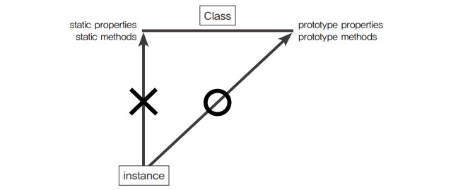

자바스크립트는 프로토타입 기반 언어라서 '상속'개념이 존재하지 않는다. 이는 클래스 기반언어에 익숙한 개발자들을 혼란스럽게 했고, 이러한 니즈에 따라 ES6에는 클래스 문법이
추가되었다. 하지만 일정 부분은 프로토타입을 활용하고 있다.

## 자바스크립트의 클래스

```var array = new Array();``` 이를 클래스라고 하면, ```Array```의 prototype 객체 내부 요소들이 인스턴스에 '상속'된다고 볼 수 있다.
엄밀히는 상속이 아닌 프로토타입 체이닝에 의한 참조지만 결과적으로 동일하게 동작하므로 이렇게 이해해도 무방하다. 한편 ```Array```
내부 프로퍼티들 중 prototype 프로퍼티를 제외한 나머지는 인스턴스에 상속되지 않는다.

```javascript
/* 스태틱 메서드, 프로토 타입 메서드 */

// 생성자
var Rectangle = function (width, height) {
  this.width = width;
  this.height = height;
};

// 포로토타입 메서드 (인스턴스 메서드)
Rectangle.prototype.getArea = function () {
  return this.width * this.height;
}

// 스태틱 메서드
Rectangle.isRectangle = function (instance) {
  return instance instanceof Rectangle && instance.width > 0 && instance.height > 0;
}

var rect1 = new Rectangle(3, 4);
console.log(rect1.__proto__.getArea());     // 12    (0)
console.log(rect1.isRectangle(rect1));      // Error (X)
console.log(Rectangle.isRectangle(rect1));  // true
```

- 프로토타입 메서드 : ```__proto__```를 생략했으므로 this가 rect1인 채로 실행되고, 결과는 12가 나온다. 이처럼 인스턴스에서 직접 호출할 수 있는 메서드가
  바로 프로토타입 메서드이다.
- 스태틱 메서드 : 스태틱 메서드는 ```__proto__```에 존재하지 않으며, ```Uncaught TypeError : not a function```에러가 발생하고,
  생성자 함수를 this로 해야만 호출하여 출력할 수 있다.



---

## 클래스 상속

프로토타입 체인을 활용해 클래스 상속을 구현하고 최대한 전통적인 객체지향 언어에서의 클래스와 비슷한 형태로 발전시켜 보는 것을 목표로 시작.

### 기본 구현

```javascript
/* Grade 생성자 함수 및 인스턴스 */
var Grade = function () {
  var args = Array.prototype.slice.call(arguments);
  for (var i = 0; i < args.length; i++) {
    this[i] = args[i];
  }
  this.length = args.length;
};
Grade.prototype = [];       // 빈 배열
var g = new Grade(100, 80);
```

위의 코드의 문제점은 length 프로퍼티가 삭제 가능하고, Grade.prototype에 빈 배열을 참조시켰다.

내장객체인 배열의 length는 configurable(삭제 불가능)라서 삭제 불가능하지만, Grade 클래스의 인스턴스의 배열 메서드를 상속하지만 기본적으로 일반 객체이기 때문에
삭제가 가능하다.

```javascript
/* Grade 예제 */
g.push(90);       // Grade { 0: 100, 1: 80, 2: 90, length: 3 }
console.log(g);

delete g.length;  // delete 가능
g.push(70);
console.log(g);   // Grade { 0: 70, 1:80, 2: 90, length: 1 }
```

위와 같이 ```g.length```를 삭제후 ```push```명령에 의해 자바스크립트 엔진이 ```g.length```가 없어 ```g.__proto__.length```를
읽어오는데, ```Grade.protoType```이 빈 배열을 가리키고 있기 때문에 70이 들어간 ```length: 1```이 나오게 되는 것이다.

```javascript
/* 요소가 있는 배열을 protoType에 매칭한 경우 */
Grade.prototype = ['a', 'b', 'c', 'd'];
var g = new Grade(100, 80);

g.push(90);
console.log(g);    // Grade { 0: 100, 1: 80, 2: 90, length: 3 }

delete g.length;
g.push(70);
console.log(g);    // Grade { '0': 100, '1': 80, '2': 90, '4': 70, length: 5 }
```

이 역시 삭제 이후 ```g.__proto__.length```를 찾아 ```push```를 진행하기 때문에 ```length: 5```가 나오게 된다.

```javascript
/* Rectangle, Square 클래스 */
var Rectangle = function (width, height) {
  this.width = width;
  this.height = height;
};
Rectangle.prototype.getArea = function () {
  return this.width * this.height;
};
var rect = new Rectangle(3, 4);
console.log(rect.getArea());                // 12

var Square = function (width) {
  this.width = width;
};
Square.prototype.getArea = function () {
  return this.width * this.width;
};
var sq = new Square(5);
console.log(sq.getArea());                  // 25
```

Rectangle와 Square 클래스는 width라는 프로터피, ```getArea```는 애용이 다르지만 비슷하다.

```javascript
/* Square 클래스 변형 */
var Square = function (width) {
  this.width = width;
  this.height = width; // Rectangle 과 같도록 형식 맞추기
};
Square.prototype.getArea = function () {
  return this.width * this.height;
};
```

위 처럼 형식을 조금만 맞추면 ```getArea```메서드는 똑같아 진다.

```javascript
/* Rectangle을 상속하는 Square */
var Square = function (width) {
  Rectangle.call(this, width, width);
};
Square.prototype = new Rectangle();
```

Square 생성자 내부 Rectangle 생성자 함수를 함수로써 호출하여 Rectangle의 인스턴스를 부여하였다. 하지만 이방법 클래스에 있는 값이 인스턴스에 영향을 줄 수
있다.

```javascript
console.dir(sq);
```


위 사진을 보면 ```__proto__```는 Rectangle의 인스턴스임을 가르키지만 width, height 가 모두 undefined가 할당돼 있다. 추가적으로
constructor가 여전히 Rectangle을 바라보고 있다.

```javascript
var rect2 = new sq.constructor(2, 3);
console.log(rect2);    // Rectangle {width: 2, height: 3}
```

### 클래스가 구체적인 데이터를 지니지 않게 하는 방법

가장 쉬운 방법으로 만들고 나서 프로퍼티들을 모두 지우고 추가할 수 없게 만드는 방법이다.

```javascript
/* protype 삭제 및 freeze */
delete Square.prototype.width;
delete Square.prototype.height;
Object.freeze(Square.prototype);
```

만약, 프로퍼티가 많다면 반복작업이 되므로 함수로 만드는 방법도 있다.

```javascript
/* 방식 1 : 인스턴스 생성후 프로퍼티 제거 */
var extendClass1 = function (SuperClass, SubClass, subMethods) {
  SubClass.prototype = new SubClass();
  for (var prop in SubClass.prototype) { // 프로퍼티 제거
    if (SubClass.prototype.hasOwnProperty(prop)) {
      delete SubClass.prototype[prop];
    }
  }
  if (subMethods) {
    for (var method in subMethods) {  // 메서드 복사
      SubClass.prototype[method] = subMethods[method];
    }
  }
  Object.freeze(SubClass.prototype);
  return SubClass;
};

var Square = extendClass1(Rectangle, function (width) {
  Rectangle.call(this, width, witdh);
});
```

방식 1 은 부모 클래스, 자식 클래스, 자식에 추가할 메서들이 정의된 객체를 넘겨 SubClass의 property를 정리하고 freeze 하는 방식이다.

```javascript
var Rectangle = function (width, height) {
  this.width = width;
  this.height = height;
};
Rectangle.prototype.getArea = function () {
  return this.width * this.height;
};
var Square = function (width) {
  Rectangle.call(this, width, width);
};
var Bridge = function () {
}; // 빈 생성자 함수
Bridge.prototype = Rectangle.prototype;
Square.prototype = new Bridge();
Object.freeze(Square.prototype);
```

방식 2는 더글라스 크락포드의 제안이며, SubClass의 prototype에 직접 SuperClass의 인스턴스를 할당하는 대신 아무런 프로퍼티를 생성하지 않는 빈 생성자 함수를
하나 더 만들어서 그 prototype이 SuperClass의 prototype을 바라보게끔 한 다음, SubClass의 prototype에는 Bridge의 인스턴스 할당하게 하는
것이다.


그림 처럼 Bridge가 Rectangle 자리를 대체하게 된다. 추가적으로 범용성을 고려하면 다음처럼 작성할 수 있을 것입니다.

```javascript
/* 방식 2 : 더글라스 크락포드 제안 */
var extendClass2 = (function () {
  var Bridge = function () {
  };
  return function (SuperClass, SubClass, subMethods) {
    Bridge.prototype = SubClass.prototype;
    SubClass.prototype = new Bridge();
    if (subMethods) {
      for (var method in subMethods) {
        SubClass.prototype[method] = subMethods[method];
      }
    }
    Object.freeze(SubClass.prototype);
    return SubClass;
  }
})();
```

즉시실행함수 내부에 Bridge를 선언해서 이를 클로저로 활용하여 메모리에 불필요한 함수 선언을 줄일 수 있다.

```javascript
/* 방식 3 : Object.create 활용 */
//...
Square.prototype = Object.create(Rectangle.prototype);
Object.freeze(Square.prototype);
//...
```

이 방법 역시 ```SubClass.prototype`````의 ```__proto__```가 ```SuperClass.prototype```를 참조하고, ```
SubClass.prototype```에는 불필요한 인스턴스 프로터피가 없게 한다.

### construtor 복구하기

위 세가지 방법 모두 기본적인 상속에는 성공했지만 SubClass 인스턴의 constructor는 여전히 SuperClass를 가리키는 상태이다. SubClass 인스턴스에는
constructor가 없고, ```SubClass.prototype```에도 없는 상태이다. 즉, ```SuperClass```가 출력될
뿐이다. ```SubClass.prototype.constructor```가 원래의 SubClass를 바라보도록 해주면 된다.

```javascript
/* 클래스 상속 및 추상화 방법 - 1 : 인스턴스 생성후 프로퍼티 제거 */
var extendClass1 = function (SuperClass, SubClass, subMethods) {
  SubClass.prototype = new SuperClass();
  for (var prop in SubClass.prototype) {
    if (SubClass.prototype.hasOwnProperty(prop)) {
      delete SubClass.prototype[prop];
    }
  }
  SubClass.prototype.constructor = SubClass; // constructor => SubClass
  if (subMethods) {
    for (var method in subMethods) {
      SubClass.prototype[method] = subMethods[method];
    }
  }
  Object.freeze(SubClass.prototype);
  return SubClass;
};
```

```javascript
/* 클래스 상속 및 추상화 방법 - 2 : 빈 함수를 활용 */
var extendClass2 = (function () {
  var Bridge = function () {
  };
  return function (SuperClass, SubClass, subMethods) {
    Bridge.prototype = SuperClass.prototype;
    SubClass.prototype = new Bridge();
    SubClass.prototype.constructor = SubClass; // constructor => SubClass
    if (subMethods) {
      for (var method in subMethods) {
        SubClass.prototype[method] = subMethods[method];
      }
    }
    Object.freeze(SubClass.prototype);
    return SubClass;
  }
})();
```

```javascript
/* 클래스 상속 및 추상화 방법 - 3 : Object.create 활용 */
var extendClass3 = function (SuperClass, SubClass, subMethods) {
  SubClass.prototype = Object.create(SuperClass.prototype);
  SubClass.prototype.constructor = SubClass; // constructor => SubClass
  if (subMethods) {
    for (var method in subMethods) {
      SubClass.prototype[method] = subMethods[method];
    }
  }
  Object.freeze(SubClass.prototype);
  return SubClass;
}
```

---

## ES6의 클래스 및 클래스 상속

```javascript
/* ES5 방식 */
var ES5 = function (name) {
  this.name = name;
};
ES5.staticMethod = function () {
  return this.name + ' staticMethod';
};
ES5.prototype.method = function () {
  return this.name + ' method';
};
var es5Instance = new ES5('es5');

/* ES6 방식 */
var ES6 = class {
  constructor(name) {     // 생성자는 constructor
    this.name = name;
  }

  // 콤마 구분하지 않음
  static staticMethod() { // static 메서드는 static 키워드
    return this.name + ' staticMethod';
  }

  method() {              // 일반 메서드
    return this.name + ' method';
  }
};
var es6Instance = new ES6('es6');
```

```javascript
/* ES6의 클래스 상속 */
var Ractangle = class {
  constructor(width, height) {
    this.width = width;
    this.height = height;
  }

  getArea() {
    return this.width * this.height;
  }
};

var Square = class extends Rectangle { // extends를 통해 상속
  constructor(width) {
    super(width, width); // super 키워드를 통해 Rectangle constructor 호출
  }

  getArea() {
    console.log('size is :', super.getArea()); // super 키워드를 통해 getArea 호출
  }
};
```
