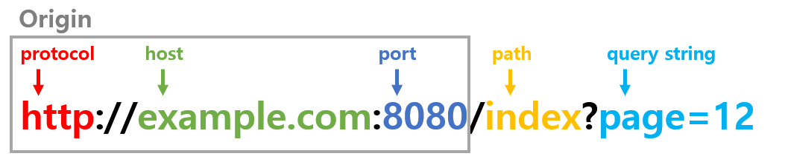

## 교차 출처 리소스 공유 (Cross-Origin Resource Sharing)

CORS는 추가 HTTP Header를 사용하여, 한 출저(Origin)에서 실행 중인 웹 애플리케이션이 다른 출저(Origin)의 선택한 자원에 접근할 수 있는 권한을 부여하도록
브라우저에 알려주는 체제이다.

웹애플리케이션은 리소스가 자신의 출저와 다를 때 교차 출처 HTTP 요청을 실행하는데 보안 상의 이유로, 브라우저는 스크립트에서 시작한 교차 출저 HTTP 요청을 제한한다.

즉, 이 API를 사용하는 웹 애플리케이션은 동일 출저 정책를 따르며, 다른 출처의 리소스를 불러오려면 그 출처에서 올바른 CORS 헤더를 포함한 응답을 반환해야 한다.

## 용어

### 출저 (Origin)

웹 콘텐츠의 Origin은 접근할 때 사용하는 URL의 스킴(프로토콜), 호스트, 포트로 정의한다.

### 동일 출저 정책 (Same Origin Policy)

동일 출처 정책은 어떤 출처에서 불러온 문서나 스크립트가 다른 출처에서 가져온 리소스와 상호 작용할 수 있는 방법을 제한하는 정책이다. 즉, 출저가 일치할 경우에만 가능하다.

만약 출저가 서로 다를 경우는 **교차 출저**라고 한다.
