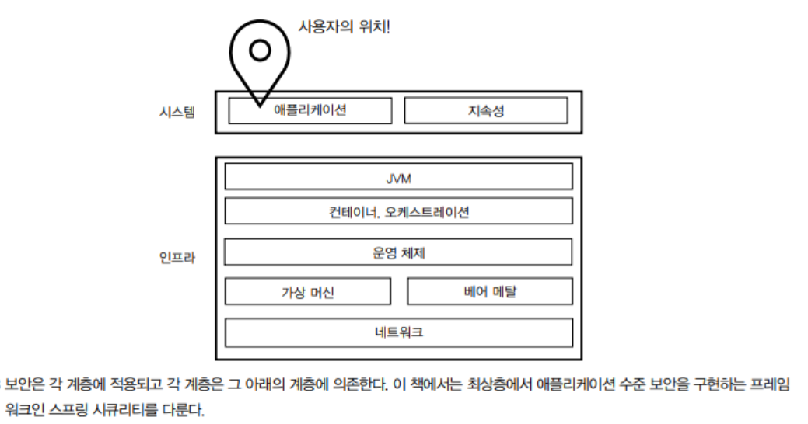
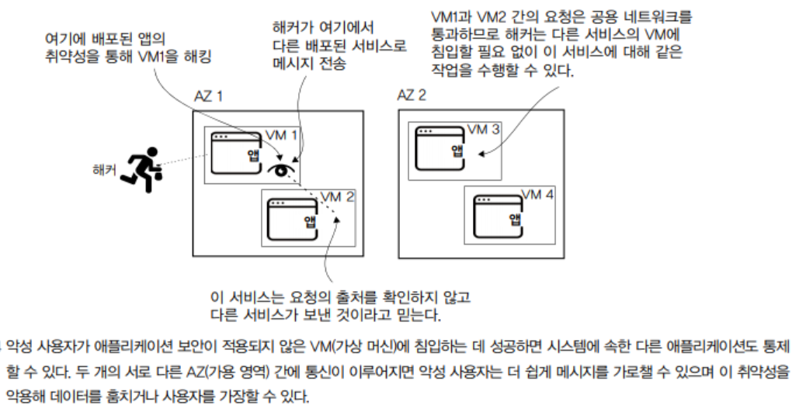
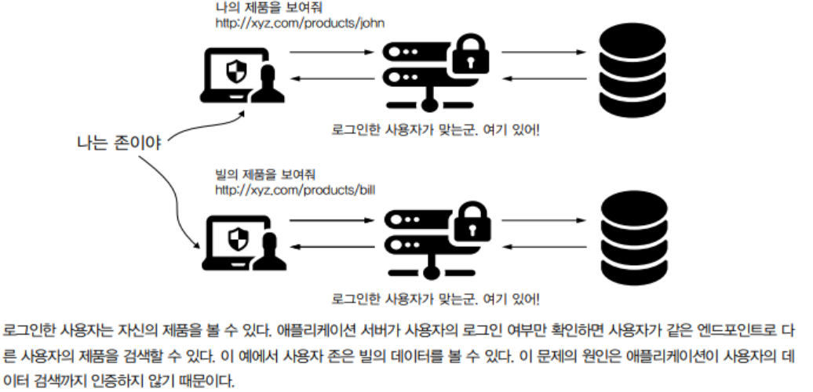
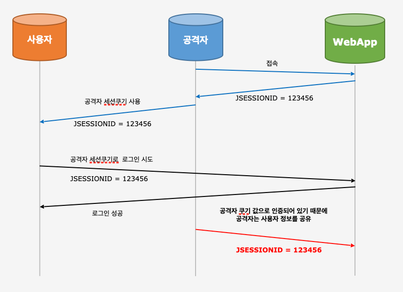
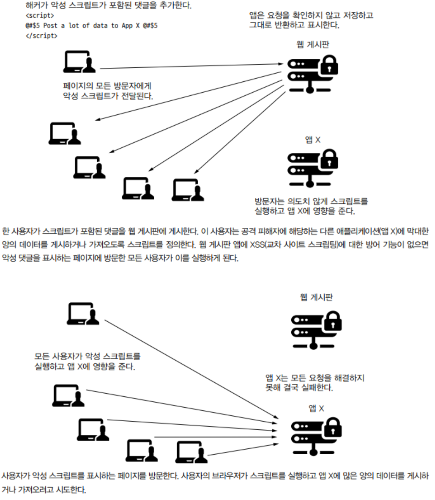
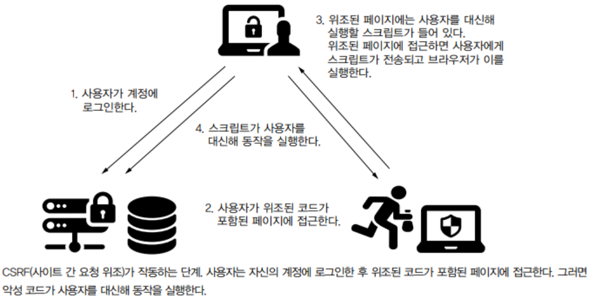

## 스프링 시큐리티: 개념과 장점

스프링 시큐리티는 스프링 애플리케이션에서 애플리케이션 수준의 보안을 구현할 때 가장 우선적인 선택이며, 인증, 권한 부여 및 일반적인 공격에 대한 방어를 구현하는 세부적인 맞춤 구성 방법을 제공한다.

---

## 소프트웨어 보안

현재의 소프트웨어 시스템은 툭히 현재 GDPR(General Data Protection Requlations: 일반 데이터 보호 규정) 요구 사항을 고려할 때 상당 부분이 민감한 정보일 수 있는 대량의 데이터를 관리한다. 

애플리케이션은 이러한 정보에 접근, 변경 또는 가로챌 기회가 없게 해야 하며 의도된 사용자 이외의 대상은 어떤 식으로든 데이터와 상호 작용할 수 없게 해야 한다. 이것이 광범위하게 표현한 보안의 의미다.

> Q. GDPR이란?
> 
> A. 일반적으로 데이터 보호와 관련해 사람들에게 개인 데이터에 대한 더 많은 제어 권한을 부여 하는 일련의 유럽 법률을 나타내며 소유자가 적용 규정을 준수하지 않으면 상당한 처벌을 받을 수 있다.

### 계층별 보안

보안은 계층별로 적용해야 하며 각 계층에 다른 접근 방식이 필요하다. 각 계층을 더 잘 보호할수록 악의적인 대상이 데이터에 접근하거나 무단 작업을 수행할 가능성이 낮아진다.



**애플리케이션 수준 보안**은 애플리케이션이 실행되는 환경과 애플리케이션이 처리하고 저장하는 데이터를 보호하기 위해 해야 하는 모든 것을 나타낸다.

소프트웨어 시스템에서 보안은 애플리케이션 수준에만 적용되는 것이 아니다.



마이크로서비스 아키텍쳐에서는 다양한 취약성이 생길 수 있으므로 주의해야 한다. 한 계층의 보안 문제를 해결할 때는 되도록 위 계층이 존재하지 않는다고 가정하는 것이 바람직하다.

---

## 웹 애플리케이션의 일반적인 보안 취약성

공격자는 공격을 시작하기 전에 애플리케이션의 **취약성(Vulnerability)** 을 파악하고 공략해야 하는데, 취약성은 악의적 의도를 가지고 원치 않는 작업을 수행하는데 이용할 수 있는 약점이다.

### 인증과 권한 부여의 취약성

#### 인증

**인증(Authentication)** 은 애플리케이션이 이를 이용하려는 사람을 식별하는 프로세스를 말한다. 

어떤 사용자가 앱을 이용하려면 추가 접근을 허가하기 전에 먼저 이들의 ID를 확인해야 한다. 익명 엑세스를 지원할 때도 있지만 대부분은 식별된 사용자만 특별 작업을 수행할 수 있다.

#### 인가

**인가(Authorization)** 는 인증된 호출자가 특정 기능과 데이터에 대한 이용 권리가 있는지 확인하는 프로세스를 말한다.

예를 들어 은행 애플리케이션에서 대부분의 인증된 사용자는 자금을 이체할 수 있지만 자신의 계좌에서만 가능하다.

#### 취약성

인증 취약성이 있다는 것은 사용자가 악의를 가지고 다른 사람의 기능이나 데이터에 접근할 수 있다는 의미다.

예를 들어, 스프링 시큐리티를 이용해 특정 엔드포인트에 접근하도록 정의할 수 있다. 하지만 데이터 수준에 제한이 없으면 다른 사용자의 데이터를 이용할 수 있는 허점이 생길 수 있다.



### 세션 고정

**세션 고정(Session fixation)** 취약성은 웹 애플리케이션의 더 구체적이고 심각한 약점이다. 이 취약성이 존재하면 공격자는 이미 생성된 세션 ID를 재이용해 유효한 사용자를 가장할 수 있다. 

이 취약성은 웹 애플리케이션이 인증 프로세스 중에 고유한 세션 ID를 할당하지 않아 기존 세션 ID가 재사용될 가능성이 있을 때 발생한다.

예를 들어, 공격자가 서버에게서 먼저 세션 ID를 받은 후, 세션 ID를 사용자에게 심어두어 사용자가 그 세션 ID로 인증하도록 유도하는 방법이다.



### XSS(교차 사이트 스크립팅)

**XSS(교차 사이트 스크립팅)** 는 서버에 노출된 웹 서비스로 클라이언트 쪽 스크립트를 주입해 다른 사용자가 이를 실행하도록 하는 공격이다.

원치 않는 외래 스크립트의 실행을 방지하기 위해 이용하기 전이나 심지어 저장하기 전에도 요청을 적절하게 '필터' 하는 과정이 필요하다. 이 취약성이 악용되면 계정 가장(세션 고정과 결합)이나 DDoS와 같은 분산 공격 참여 등의 결과가 발생할 수 있다.



### CSRF(사이트 간 요청 위조)

**CSRF(사이트 간 요청 위조)** 도 웹 애플리케이션에 흔한 취약성이다. CSRF 공격은 특정 서버에서 작업을 호출하는 URL을 추출해 애플리케이션 외부에서 재사용할 수 있다고 가정한다. 서버가 요청의 출저를 확인하지 않고 무턱대고 실행하면 다른 모든 곳에서 요청이 실행될 수 있다.



#### XSS 와 CSRF 차이점

**XSS 공격 (사이트 간 스크립팅)** 공격은 사용자가 웹사이트를 신용하여 악성 스크립트가 실행된다면, **CSRF 공격**은 반대로 특정 웹사이트가 사용자의 브라우저를 신용하여 발생하는 공격이다. 간단히 말해서, **XSS 공격은 악성 코드가 클라이언트에서 발생하는데 반에, CSRF 공격은 악성 코드가 서버에서 발생**한다고 볼 수 있다.


### 웹 애플리케이션의 주입 취약성 이해

주입 공격은 광법위한 공격 방식이다. **주입(Injection)** 공격에서 공격자는 시스템에 특정 데이터를 유입하는 취약성을 이용한다. 공격의 목표는 시스템에 피해를 주고, 원치 않는 방법으로 데이터를 변경하거나 원래는 접근할 수 없는 데이터를 검색하는 것이다.

주입 공격은 시스템에 피해를 가할 목적의 클라이언트 쪽 스크립트를 주입한다. 다른 예로는 SQL 주입, XPath 주입, OS 명령 주입, LDAP 주입 등 여러가지 방식이 있다.

주입은 피해 시스템의 데이터를 변경, 삭제, 무단 이용을 유발하는 중요한 취약성 유형이다.

### 민감한 데이터의 노출 처리하기

민감한 데이터의 노출과 관련해서는 애플리케이션에서 콘솔에 기록하거나 스플렁크(Splunk)나 일래스틱서치(Elasticsearch) 같이 데이터베이스에 저장하는 로그 정보도 있다. 이러한 중요한 데이터를 노출해서는 안된다.

#### 로그 노출

```
[오류] 요청의 서명이 잘못되었습니다. 사용할 올바른 키는 X 입니다.
[경고] 사용자 X가 올바른 암호 Y를 이용하여 로그인했습니다.
```

이 처럼 주요한 정보를 로그로 노출하면 안된다.

#### 응답 본문

애플리케이션 동작도 데이터 노출을 통한 취약성이다. 잘못된 요청 떄문에 앱에서 NullPointerException이 발생하는 경우 응답 본문에 예외가 나오지 않도록 해야 한다. 또한 500이 아닌 400이어야 한다.

```
{
  "상태" : 500,
  "오류" : "내부 서버 오류",
  "메세지" : "IP 주소 10.2.5.8/8080에 대한 연결이 발견되지 않음",
  "경로: : "/product/add"
}
```

상태 500일 경우 서버의 문제로 예외 메세지에 IP주소가 공개된 것을 알 수 있다. 공격자는 이 주소를 보고 네트워크 구성을 파악하고 최종적으로 인프라의 VM을 통제하는 방법을 찾아낼 수 있다.

```
{
  "상태" : 401,
  "오류" : "권한 없음",
  "메세지" : "암호가 올바르지 않음",
  "경로: : "/login"
}
```

이 처럼 메세지를 노출하면 아이디는 맞다고 가정할 수 있다. 이 경우 무차별 대입 공격에 더 취약해질 수 있다.

```
{
  "상태" : 401,
  "오류" : "권한 없음",
  "메세지" : "사용자 이름 또는 암호가 올바르지 않음",
  "경로: : "/login"
}
```

위와 같이 처리하는 것이 좋다.

### 메세지 접근 제이 부족

애플리케이션 수준에도 한 계층에만 권한 부여를 적용하면 안된다.


컨틀롤러 계층에만 부여할 경우 지금 당장은 문제가 되지 않지만 향후 구현을 추가할 때 모든 권한 부여 요구 사항을 테스트하지 않고 해당 기능을 노출하는 문제의 소지가 있다.


### 알려진 취약성이 있는 종속성 이용

종속성은 스프링 시큐리티와 직접적인 연관은 없지만 라이브러리나 프레임워크 같은 종속성에 취약성이 있을 수 있다. 이용하는 종속성을 항상 주의 깊게 살펴보고 알려진 취약성이 있는 버전을 제거해야 한다.

## 다양한 아키텍처에 적용된 보안

구현하는 솔루션에 따라 보안 접근 방식이 다르므로 스프링 시큐리티의 구성도 다르다.

### 일체형 웹 애플리케이션 설계

이 애플리케이션에는 백엔드와 프론트엔드 개발 간의 직접적인 분리가 없는 서비스로 애플리케이션이 HTTP 요청을 수신하고 HTTP 응답을 클라이언트에 보내는 일반 서블릿 흐름을 통하는 것이다.


세션이 있는 한 세션 고정 취약성과 CSRF 가능성을 고려해야 하고 HTTP 세션에 저장하는 정보도 고려해야 한다.

### 백엔드/프론트엔드 분리를 위한 보안 설계

웹 애플리케이션을 개발할 때 프론트엔드와 백엔드를 분리하여 개발하는 경우가 많은데, 이 경우 프론트엔드로 react, Vue.js 와 같은 프레임워크를 이용해 REST 앤드포인트를 통해 백엔드와 통신한다.


CORS 구성으로 꼭 백엔드와 프론트엔드를 같은 출저로 하지않아도 된다. 이를 위해 엔드포인트 인증에 HTTP Basic을 이용하는 방법이 실용적이고 간단하지만 여러가지 문제가 있어 권장하지 않는다.

이를 고려해 OAuth 2 흐름이라는 더 나은 접근법을 이용하는 인증과 권한 부여한다.

### OAuth 2 흐름 이해

OAuth 2 프레임워크는 권한 부여 서버와 리소스 서버라는 두 가지 별도의 엔티티를 정의한다. 권한 부여 서버의 목적은 사용자에게 권한을 부여하고 사용자의 이용 권리 집합을 지정하는 토큰을 제공하는 기능을 구현하는 백엔드 부분을 **리소스 서버**라고 하며 호출할 수 있는 엔드포인트는 **보호된 리소스**로 볼 수 있다.

#### 작업 단계


1. 사용자가 애플리케이션(클라이언트)의 기능에 접근한다. 애플리케이션은 백엔드의 리소스를 호출한다.
2. 애플리케이션이 리소스를 호출하려면 먼저 액세스 토큰을 얻어야 하므로 권한 부여 서버를 호출해서 토큰을 얻는다.
3. 자격 증명이나 갱신 토큰이 올바르면 권한 부여 서버가 새로운 엑세스 토큰을 클라이언트로 반환한다.
4. 필요한 리소스를 호출할 때 리소스 서버에 대한 요청의 헤더는 액세스 토큰을 이용한다.

#### 토큰

토큰의 수명은 고정되고 일반적으로 오래 유지되지 않으며 토큰이 만료되면 앱이 새 토큰을 받아야 한다. 서버는 필요한 경우 토큰의 만료 시간보다 일찍 토큰을 실격시킬 수 있다.

- 클라이언트는 사용자 자격 증명을 저장할 필요 없이 엑세스 토큰과 갱신 토큰만 저장하면 된다.
- 애플리케이션은 사용자 자격 증명을 노출하지 않는다.
- 누군가가 토큰을 가로채면 사용자 자격 증명을 무효로 할 필요 없이 토큰을 실격시킬 수 있다.
- 토큰을 이용하면 제삼자가 사용자를 가장하지 않고도 사용자 대신 리소스에 접근할 수 있다. 물론 이 경우 공격자가 토큰을 훔칠 수 있지만 토큰은 일반적으로 수명이 제한되므로 이 취약성을 악용할 수 있는 기간도 제한된다.
