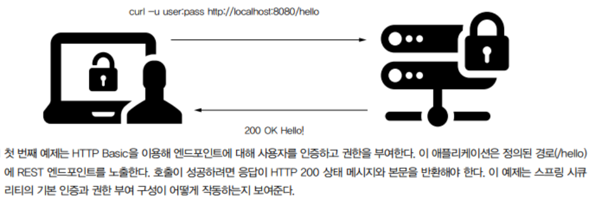
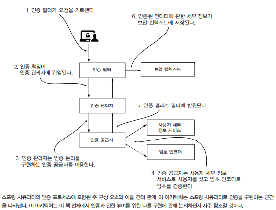
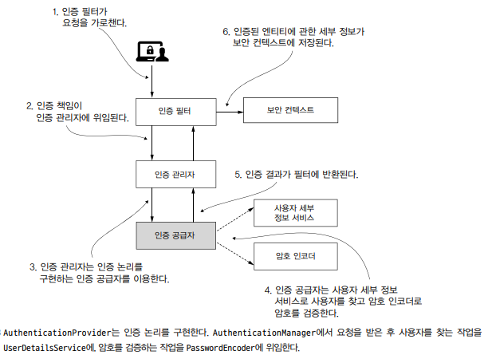

## 첫 번쨰 프로젝트 시작

REST 엔드포인트 하나를 노출하는 작은 웹 어플리케이션으로 스프링 시큐리티로 HTTP Basic 인증을 이용해 엔드포인트를 보호하는 방법을 볼 수 있다.



```java
/* HelloController 클래스와 REST 엔드포인트 선언 */
@RestController
public class HelloController {

  @GetMapping("/hello")
  public String hello() {
    return "Hello!";
  }
}
```

> Q. Basic 인증이란?
>
> A. 말그대로 가장 기본적인 인증 방식으로 인증 정보로 base64로 인코딩한 "사용자 ID:password" 문자열을 ```Basic```과 함께 인증 헤더에 입력하는 방식을 말한다.

다음 프로젝트를 시작할 경우 ```Using generated security password: [password]```로 새 암호가 생성된다. HTTP Basic 인증으로
애플리케이션의 엔드포인트를 호출하려면 이 암호를 이용해야 한다.

### Authorization 헤더 X

```http request
### /hello 요청
GET http://localhost:8080/hello
```

Authorization 헤더를 사용하지 않았기 때문에 **응답 상태로 HTTP 401 권한 없음** 이 반환된다. 인증을 위한 올바른 자격 증명을 제공하지 않았기 때문에 예상된
결과다.

### Authorization 헤더 O

```http request
### /hello 요청
GET http://localhost:8080/hello
Authorization: Basic user [password]
```

스프링 시큐리티의 기본 이름인 user와 password를 올바르게 넘기면 ```hello!``` 로 올바른 응답이 온다.

---

## 기본 구성

기본 구성이란 스프링 시큐리티 재정의를 하지않은 프로젝트로 스프링 시큐리티의 기본 구성은 아래와 같이 동작한다.



### UserDetailsService

사용자에 관한 세부 정보는 스프링 시큐리티로 UserDetailsService 계약을 구현하는 객체가 관리한다.

기본 구성은 애플리케이션의 내부 메모리에 기본 자격 증명을 등록하는 일만 한다.

이러한 **기본 자격 증명에서 사용자 이름은 'user' 기본 암호는 'UUID 형식'이며 암호는 스프링 컨텍스트가 로드될 때 자동으로 생성**된다.

하지만 이러한 기본 구현은 증명의 역할을 하며 종속성 작동 여부만 체크하기 때문에 메모리에 보관한다. 즉, 애플리케이션은 자격 증명을 보존하지 않는다. 그렇게 때문에 운영 단계
애플리케이션에서는 피해야한다.

### PasswordEncoder

PasswordEncoder 객체는 ```암호를 인코딩, 기존 인코딩과 일치여부 확인```하는 일을 하는데 Basic 인증 흐름에 꼭 필요하다. UserDetailsService의
기본 구현을 대체할 때는 PasswordEncoder도 지정해야 한다.

### AuthenticationProvider

AuthenticationProvider는 인증 논리를 정의하고 사용자와 암호의 관리를 위임한다. 기본 구현은 userDetailsService 및 PasswordEncoder에
제공된 기본 구현을 이용한다.

---

## 기본 구성 재정의

### UserDetailsService 구성 요소 재정의

이 단원에서는 간단하게 InMemoryUserDetailsManager라는 구현을 이용한다.

```java
/* config 클래스 */
@Configuration
public class ProjectConfig {

  @Bean
  public UserDetailsService userDetailsService() {
    return new InMemoryUserDetailsManager();
  }
}
```

해당 빈을 등록후 실행하면 애플리케이션은 자동 구성된 기본 구성 요소 대신 컨텍스트에 추가한 UserDetailsService 형식의 인스턴스를 이용하기 때문에 두 가지 이유로
엔드포이늩에 접근 할 수 없다.

1. 사용자가 없다. (사용자가 없기 때문에 자동 생성된 암호를 콘솔 출력 및 생성하지 않는다.)
2. PasswordEncoder가 없다.

그렇기 떄문에 인증을 위해서는 PasswordEncoder가 필요하다. 문제를 해결하기 위해서는 다음과 같은 단계를 이용히여 해결할 수 있다.

1. 자격 증명(사용자 이름 및 암호)이 있는 사용자를 하나 이상 만든후 사용자를 UserDetailsService에서 관리하도록 추가한다.
3. 주어진 암호를 UserDetailsService가 저장하고 관리하는 암호를 이용해 검증하는 PasswordEncoder 형식의 빈을 정의한다.

이 단원에서는 간단하게 미리 정의된 빌더를 이용해 UserDetails 형식의 객체를 만든다.

### 1. 자격 증명 생성 및 추가

UserDetailsService에 하나의 UserDetails를 생성 및 추가해준다.

```java
/* userDetails 에 사용자(UserDetails) 저장 */
@Configuration
public class ProjectConfig {

  @Bean
  public UserDetailsService userDetailsService() {
    InMemoryUserDetailsManager userDetailsService = new InMemoryUserDetailsManager();
    UserDetails user = User.withUsername("tester")
      .password("1234")
      .authorities("read")
      .build();
    userDetailsService.createUser(user);
    return userDetailsService;
  }
}
```

### 2. PasswordEncoder

예제에서 간단하게 사용할 수 있게 String.equals 로 비교하는 NoOpPasswordEncoder 를 빈으로 등록한다.

```java
  /* passwordEncoder 빈 추가 */
  @Bean
  public PasswordEncoder passwordEncoder(){
    // 암호를 사용하지않고 일반 텍스트처럼 처리하는 인스턴스로 실무에서 사용 X
    return NoOpPasswordEncoder.getInstance();
  }
```

```http request
### 만든 사용자를 통해 접근 시도
GET http://localhost:8080/hello
Authorization: Basic tester 1234
```

결과를 확인하면 원하는대로 동작하는 것을 확인할 수 있다.

---

## 엔드포인트 권한 부여 구성 재정의

책에서는 WebSecurityConfigurerAdapter 를 확장하여 configure를 구현하는 방식으로 하였지만 security 6 이후로는 지원하지 않기 때문에 수정하여
진행하였다.

SecurityFilterChain 를 통해 구성을 재정의 할 수 있다.

```java
/* HttpSecurity 매개 변수로 구성 변경 */
@EnableWebSecurity
@Configuration
public class ProjectConfig {

  @Bean
  public SecurityFilterChain filterChain(HttpSecurity http) {
    http.httpBasic(Customizer.withDefaults());
    http.authorizeHttpRequests(
      authz -> authz.anyRequest().authenticated()
    ); // 모든 요청에 인증이 필요하다.
    return http.build();
  }
}
```

Authorization와 함께 요청을 해야 확인할 수 있다.

```java
  /* permitAll()을 이용해 권한 부여 구성 변경 */
  @Bean
  public SecurityFilterChain filterChain(HttpSecurity http) throws Exception {
    http.httpBasic(Customizer.withDefaults());
    http.authorizeHttpRequests(
        authz->authz.anyRequest().permitAll()
    ); // 인증 없이 요청할 수 있다.
    return http.build();
  }
```

```http request
### Authorization 없이 요청
GET http://localhost:8080/hello
```

Authorization가 없어도 ```hello!```를 확인할 수 있다.

---

## AuthenticationProvider 구현 재정의

AuthenticationProvider는 인증 논리를 구현하고 사용자 관리와 암호 관리는 UserDetailsService 및 PasswordEncoder에 위임한다.



아래와 같이 구현할 수 있다.

```java
/* 간단한 Provider 구현 */
@ComponentScan
public class CustomAuthenticationProvider implements AuthenticationProvider {

  @Override // 인증 논리
  public Authentication authenticate(Authentication authentication) throws AuthenticationException {
    String userName = authentication.getName(); // Principal
    String password = String.valueOf(authentication.getCredentials());

    //if-else 절 : UserDetailsService 및 PasswordEncoder를 사용하지 않고 간단하게 대체
    if ("tester".equals(userName) && "1234".equals(password)) {
      return new UsernamePasswordAuthenticationToken(userName, password, List.of());
    } else {
      throw new AuthenticationCredentialsNotFoundException("Error in authentication");
    }
  }

  @Override // Authentication 형식의 구현을 추가할 위치
  public boolean supports(Class<?> authenticationType) {
    return UsernamePasswordAuthenticationToken.class.isAssignableFrom(authenticationType);
  }
}
```

if-else 절의 조건은 UserDetailsService 및 PasswordEncoder의 책임을 대체한다. 두 개의 빈을 이용해야 하는 것은 아니지만, 인증을 위해 사용자와
암호를 관리한다면 논리를 분리하는 것이 좋다. 즉, 인증 구현을 재정의 할 때도 스프링 시큐리티 아키텍처의 설계를 따르는 것이 좋다.

기본 구현이 맞지 않다면 위와 같이 구현하여 사용할 수 있다.

```java
/* provider 등록 */
@EnableWebSecurity
@Configuration
public class ProjectConfig {

  @Autowired
  private AuthenticationProvider authenticationProvider;

  @Bean
  public SecurityFilterChain filterChain(HttpSecurity http) throws Exception {
    http.httpBasic(Customizer.withDefaults());
    http.authorizeHttpRequests(
        authz -> authz.anyRequest().authenticated()
      )
      .authenticationProvider(authenticationProvider);
    return http.build();
  }
}
```

인증 논리에 정의된 유일하게 익신된 사용자 tester:1234 를 이용해 엔드포인트를 호출할 수 있다.

---

## 프로젝트에 여러 구성 클래스 이용

하나의 구성 클래스에 모든 것을 담는 것은 복잡해지기 때문에 좋은 방식이 아니다. 항상 한 클래스가 하나의 책임을 맡도록 하는 것이 바람직하다.

```java
/* 사용자 관리와 암호 관리를 위한 구성 클래스 정의 */
@Configuration
public class UserManagementConfig {
  @Bean
  public UserDetailsService userDetailsService() {
    //...
  }
  @Bean
  public PasswordEncoder passwordEncoder() {
    //...
  }
}
```

```java
/* 권한 부여 관리를 위한 구성 클래스 정의 */
@Configuration
public class WebAuthorizationConfig {
  @Bean
  public SecurityFilterChain filterChain(HttpSecurity http) throws Exception {
    //...
  }
}
```
