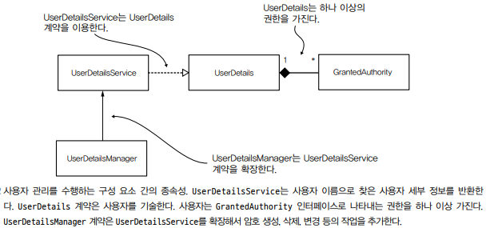

## 스프링 시큐리티의 인증 구현

사용자 관리를 위해서는 UserDetailsService 및 UserDetailsManager 인터페이스를 이용한다.

- UserDetailsService : 사용자 이름으로 사용자를 검색하는 역할만 한다. 이 작업은 프레임워크가 인증을 완료하는 데 반드시 필요한 유일한 작업이다.
- UserDetailsManager : 대부분의 애플리케이션에 필요한 사용자 추가, 수정, 삭제 작업을 추가한다.



사용자는 사용자가 수행할 수 있는 권한(작업을 나타내는 이용 권리)의 집합을 가지는데 현재 파트에서는 GrantedAuthority 인터페이스로 나타낸다는 것만 알고 넘어간다.

---

## 사용자 기술하기

애플리케이션은 사용자가 누구인지에 따라 특정 기능을 호출할 수 있는지 여부를 결정한다. 사용자에 대한 작업을 하려면 먼저 애플리케이션에서 사용자의 프로토타입을 정의하는 방법을
알아야 하는데, 스프링 시큐리티에서 사용자 정의는 UserDetails 계약을 준수해야 한다.

즉, UserDetails 인터페이스를 구현해야 한다.

### UserDetails 계약의 정의 이해하기

```java
/* UserDetails 인터페이스 */
public interface UserDetails extends Seraializable {

  // 사용자 자격 증명을 반환하는 두 메서드
  String getUserName();

  String getPassword();

  // 앱 사용자가 수행할 수 있는 작업을 GrantedAuthority 인스턴스 컬랙션으로 반환
  Collection<? extends GrantedAuthority> getAuthorities();

  // 사용자 계정을 비/활성화하는 네 메서드
  boolean isAccountNonExpired();

  boolean isAccountNonLocked();

  boolean isCredentialNonExpired();

  boolean isEnabled();
}
```

UserDetails 계약을 보면 계정 만료, 잠금, 비활성화, 자격 증명 만료 작업을 할 수 있다.

### GrantedAuthority 계약 살펴보기

UserDetails 인터페이스 정의를 보면 알 수 있지만, 사용자에게 허가된 작업을 권한(authority)이라고 한다.

권한은 사용자가 애플리케이션에서 수행할 수 있는 작업을 나타낸다. 스프링 시큐리티에서는 GrantedAuthority 인터페이스로 권한을 나타낸다.

```java
/* GrantedAuthority 인터페이스 */
public interface GrantedAuthority extends Serializable {

  String getAuthority();
}
```

GrantedAuthority는 Functional 인터페이스로 람다 식을 통해 구현할 수 있다.

```java
GrantedAuthority g1=()->"READ";
  GrantedAuthority g2=new SimpleGrantedAuthority("READ");
```

### 최소한의 UserDetails 구현 작성

```java
/* 간단한 UserDetails 구현체 */
public class SimpleUser implements UserDetails {

  private final String username;
  private final String password;

  public SimpleUser(String username, String password) {
    this.username = username;
    this.password = password;
  }

  @Override
  public String getUsername() {
    return this.username;
  }

  @Override
  public String getPassword() {
    return this.password;
  }

  // 생략...
}
```

### 빌더를 이용해 UserDetails 형식의 인스턴스 만들기

간단한 애플리케이션의 경우 UserDetails 인터페이스의 구현체를 구현할 필요가 없다. userdetails 패키지의 User 클래스를 이용하여 UserDetails 형식의
인스턴스를 생성할 수 있다.

```java
UserDetails u=User.withUsername("tester")
  .password("1234")
  .authorities("read","write")
  .accountExpired(false)
  .disabled(true)
  .build();
```

### 사용자와 연관된 여러 책임 결합

UserDetails를 구현한 엔티티를 사용하는 것은 연관관계가 존재할 때 복잡해지기 때문에 권장하지 않는다.

엔티티와 별도의 클래스를 만들어 처리하는 것이 좋다.

```java
/* JPA User 엔티티 클래스 정의 */
@Entity
public class SecurityUser implements UserDetails {

  private final User user;

  @Override
  public String getUserName() {
    return user.username;
  }

  @Override
  public String getPassword() {
    return user.password;
  }

  @Override
  public String getAuthority() {
    return user.authority;
  }

  @Override
  public CollectionM<? extends GrantedAuthroity> getAuthorities() {
    return List.of(() -> user.authority);
  }
  // ...
}
```

---

## 스프링 시큐리티가 사용자를 관리하는 방법 지정

### UserDetailsService 계약의 이해

```java
/* UserDetails 인터페이스 */
public interface UserDetailsService {

  UserDetails loadUserByUsername(String username) throws UserNotFoundException;
}
```

인증 구현은 loadUserByUsername 메서드를 호출해 주어진 사용자 이름을 가진 사용자의 세부 정보를 얻는다.


### UserDetailsService 계약 구현

```java
/* UserDetails 구현 */
@AllArgsConstructor
public class User implements UserDetails {

  private final String username;
  private final String password;
  private final String authority;

  @Override
  public Collection<? extends GrantedAuthority> getAuthorities() {
    return List.of(() -> authority);
  }

  @Override
  public String getPassword() {
    return password;
  }

  @Override
  public String getUsername() {
    return username;
  }

  // isAccountNonExpired, isAccountNonLocked, isCredentialsNonExpired, isEnable is return true
}
```

```java
/* UserDetailsService 인터페이스의 구현 */
@AllArgsConstructor
public class InMemoryUserDetailsService implements UserDetailsService {

  private final List<UserDetails> users;

  @Override
  UserDetails loadUserByUsername(String username) throws UserNotFoundException {
    return users.stream()
      .filter(u -> u.getUsername.equals(username))
      .findFirst()
      .orElseThrow(UsernameNotFoundException::new)
  }

  ;
}
```

메모리 기반(InMemoryUserDetailsService)으로 나중에는 데이터베이스, 외부 시스템, 볼트 등 로드하도록 구현해야 한다.

loadUserByUsername 메서드는 일치할 경우 리턴하고 없을 경우 UsernameNotFoundException 예외를 발생시킨다.

```java
/* 구성 클래스에 빈으로 등록 */
@Configuration
public class ProjectConfig {

  @Bean
  public UserDetailsService userDetailsService() {
    UserDetails u = new User("tester", "1234", "read");
    List<UserDetails> users = List.of(u);
    return new InMemoryUserDetailsService(users);
  }

  @Bean
  public PasswordEncoder passwordEncoder() {
    return NoOpPasswordEncdoer.getInstance();
  }
}
```

```java
/* 테스트용 엔드포인트 정의 */
@RestController
public class HelloController {

  @GetMapping("/hello")
  public String hello() {
    return "hello";
  }
}
```

```http request
### /hello 요청
GET http://localhost:8080/hello
Authorization: Basic tester 1234
```

원하는 엔드포인트 결과인 hello가 나온다.

### UserDetailsManager 계약 구현

애플리케이션에서는 사용자를 관리하는 기능이 필요하고 대부분의 앱은 최소한 새 사용자를 추가하거나 기존 사용자를 삭제할 수 있어야 한다. 이때는 스프링 시큐리티에서 제공하는
UserDetailsService를 확장한 인터페이스인 UserDetailsManager를 구현한다.

```java
/* UserDetailsManager 인터페이스 */
public interface UserDetailsManager extends UserDeatailsService {

  void createUser(UserDetails user);

  void updateUser(UserDetails user);

  void deleteUser(String username);

  void changePassword(String oldPassword, String newPassword);

  boolean userExists(String username);
}
```

---

## 사용자 관리에 JdbcUserDetailsManager 이용

JdbcUserDetailsManager는 SQL 데이터베이스에 저장된 사용자를 관리하며 JDBC를 통해 데이터베이스에 직접 연결한다. 이 처럼
JdbcUserDetailsManager는 데이터베이스 연결과 관련한 다른 프레임워크나 사양으로 부터 독립적일 수 있다.


```sql
# users 테이블
CREATE TABLE IF NOT EXISTS 'users'
(
  'id'       INT         NOT NULL AUTO_INCREMENT PRIMARY KEY,
  'username' VARCHAR(45) NOT NULL,
  'password' VARCHAR(45) NOT NULL,
  'enabled'  INT         NOT NULL,
)
INSERT INTO users (username, password, enabled)
VALUES ('tester', '1234', 1);
```

```sql
# authorities 테이블 - 편의를 위해 외래 키 정의 생략
CREATE TABLE IF NOT EXISTS 'authorities'
(
  'id'        INT         NOT NULL AUTO_INCREMENT PRIMARY KEY,
  'username'  VARCHAR(45) NOT NULL,
  'authority' VARCHAR(45) NOT NULL
)
INSERT INTO authorities (username, authority)
VALUES ('tester', 'write')
```

```java
/* JdbcUserDetailsManager 빈 등록 */
@Configuration
public class ProjectConfig {

  // table 명을 Jdbc가 원하는 대로 설계시 별도의 쿼리를 작성하지 않아도 된다.
  @Bean
  public UserDetailsService userDetailsService(DataSource dataSource) {
    return new JdbcUserDetailsManager(dataSource);
  }

  @Bean
  public PasswordEncoder passwordEncoder() {
    return NoOpPasswordEncoder.getInstance();
  }
}
```

```http request
### /hello 요청
GET http://localhost:8080/hello
Authorization: Basic tester 1234
```

원하는 엔드포인트 결과인 hello가 나온다.

```java
/* JdbcUserDetailsManager 재구성 */
@Configuration
public class ProjectConfig {

  @Bean
  public UserDetailsService userDetailsService(DataSource dataSource) {
    String usersByUsernameQuery = "select ...";
    String authsByUserQuery = "select ...";
    UserDetailsService ubs = new JdbcUserDetailsManager(dataSource);
    ubs.setAuthsByUserQuery(usersByUsernameQuery);
    ubs.setAuthsByUserQuery(authsByUserQuery);
    return ubs;
  }
}
```

JdbcUserDetailsManager 의 쿼리를 위와 같이 재정의하여 사용할 수 있다.

추가적으로 LDAP 용 LdapUserDetailsManager도 제공하지만 LDAP 시스템을 통합해야 하는 경우가 아니면 사용되지 않는다.

