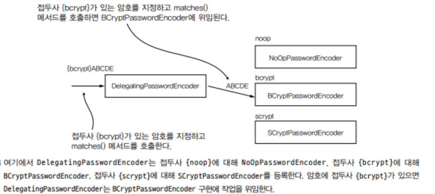

## PasswordEncoder 계약의 이해


일반적으로 시스템은 암호를 일반 텍스트로 관리하지 않고 공격자가 암호를 읽고 훔치기 어렵게 하기 위한 일종의 변환 과정을 거친다.

시큐리티에서는 이 책임을 위해 정의된 별도의 계약이 PasswordEncoder이다.

### PasswordEncoder

PasswordEncoder는 인증 프로세스에서 암호가 유효한지를 확인한다.

```java
/* PasswordEncoder 인터페이스 */
public interface PasswordEncoder {

  // 메서드는 주어진 문자열을 변환해 반환하는 메서드
  String encode(CharSequence rawPassword);

  // 지정된 암호를 인증 프로세스에서 알려진 자격 증명의 집합을 대상으로 비교
  boolean matches(CharSequence rawPassword, String encodedPassword);

  // 기본값은 false 로 true를 반환하도록 재정의하면 인코딩된 암호를 보안 향상을 위해 다시 인코딩
  default boolean upgradeEncoding(String encodedPassword) {
    return false;
  }
}
```

### PasswordEncoder 계약의 구현

```java
/* PasswordEncoder의 가장 단순한 구현 */
public class PlainTextPasswordEncoder implements PasswordEncoder {

  @Override
  public String encode(CharSequence rawPassword) {
    return rawPassword.toString();
  }

  @Override
  public boolean matches(CharSequence rawPassword, String encodedPassword) {
    return rawPassword.equals(encodedPassword);
  }
}
```

### PasswordEncoder의 제공된 구현

- NoOpPasswordEncoder : 암호를 인코딩하지 않고 일반 테긋트로 유지
- StandardPasswordEncoder : SHA-256을 이용해 암호를 해시한다. 이 구현은 이제 구식이며 **잘 사용하지 않는다.**
- Pbkdf2PasswordEncoder : PBKDF2를 이용
- BCryptPasswordEncoder : bcrypt 강력 해싱 함수로 암호를 인코딩
- SCryptPasswordEncoder : scrypt 해싱 함수로 암호를 인코딩

#### StandardPasswordEncoder

```
// StandardPasswordEncoder(비밀의 값)
PasswrordEncoder p = new StandardPasswordEncoder("secret");
```

StandardPasswordEncoder은 SHA-456 해싱 방식을 사용한다. 추가적으로 비밀의 값을 설정으로 해싱 프로세스에 적용할 비밀을 지정할 수 있다.

비밀의 값은 생성자의 매개 변수로 전달하며 인수가 없는 생성자를 호출하면 빈 문자열이 키 값으로 이용된다.

#### Pbkdf2PasswordEncoder

```
// Pbkdf2PasswordEncoder(키의 값, 암호 인코딩의 반복횟수, 해시의 크기)
PasswrordEncoder p = new Pbkdf2PasswordEncoder("secret", 185000, 256);
```

Pbkdf2PasswordEncoder는 PBKDF2 방식으로 암호를 해싱한다.

PBKDF2는 반복 횟수 인수만큼 HMAC를 수행하는 아주 단순하고 느린 해싱 함수다. 반복횟수, 해시의 크기를 크게하면 암호는 강력해지지만 속도가 느려진다.

#### BCryptPasswordEncoder

```
// BCryptPasswordEncoder(강도 계수, SecureRandom);
SecureRandom s = SecureRandom.getInstanceStrong();
PasswordEncdoer p = new BCryptPasswordEncoder(4, s);
```

BCryptPasswordEncoder는 bcrypt 강력 해싱 함수로 암호를 인코딩한다. 또한 인코딩에 이용되는 SecureRandom 인스턴스를 변경할 수도 있다.

#### SCryptPasswordEncoder

```
// SCryptPasswordEncoder(CPU비용, 메모리 비용, 병렬화 개수, 키 길이, 솔트 길이);
PasswordEncoder p = new SCryptPasswordEncoder(16384, 8, 1, 32, 64);
```

SCryptPasswordEncoder는 scrypt 해싱 함수로 암호를 인코딩한다.

#### DelegatingPasswordEncoder

일부 애플리에키션에서는 다양한 암호 인코더를 갖추고 특정 구성에 따라 선택하는 방식이 유용할 수 있다.

DelegatingPasswordEncoder는 PasswordEncoder 인터페이스의 한 구현이며 자체 인코딩 알고리즘을 구현하는 대신 같은 계약의 다른 구현 인스턴스에 작업을
위임한다. 해시는 해당 해시를 의미하는 알고리즘의 이름을 나타내는 접두사로 시작한다.




```java
/* DelegatingPasswordEncoder 인스턴스 예시 */
@Configuration
public class ProjectConfig {
  // 생략된 코드

  @Bean
  public PasswordEncoder passwordEncoder() {
    Map<String, PasswordEncoder> encoders = new HashMap<>;
    encoders.put("noop", NoOpPasswordEncoder.getInstance());
    encoders.put("bcrypt", new BCryptPasswordEncoder());
    encoders.put("scrypt", new SCryptPasswordEncoder());
    // 기본 encoder를 bcrypt
    return new DelegatingPasswordEncoder("bcrypt", encoders);
  }
}
```

---

## 스프링 시큐리티 암호화 모듈에 관한 추가 정보

추후 필요시 다룸..
